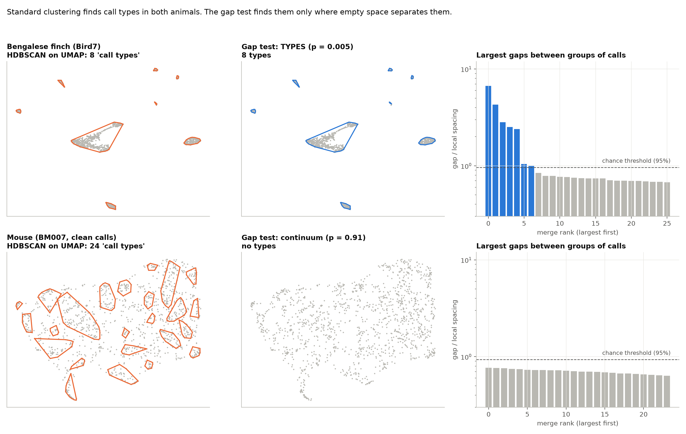

# isthmus

**Check for types before you cluster.** Standard clustering tools find 7-20 "call types" in simulated animal-call repertoires that have none. `isthmus` is a calibrated topological test that asks first: is there empty space between kinds of calls at all?

**Project page, with figures and results:** https://joshuadebellis.github.io/isthmus/



## Install and use

```
pip install git+https://github.com/joshuadebellis/isthmus
```

```python
from isthmus import gap_test

res = gap_test(Z)        # Z: (n_calls, n_features), e.g. PCA of spectrograms
print(res)               # verdict, p-value, number of types, gaps, threshold
res.is_discrete          # True if there is empty space between types
res.groups               # one group label per call (-1 = too small to call)
```

Run `python -m isthmus` for a built-in self-test on three known cases.

## What is here

- `isthmus/` - the method (minimum spanning tree / 0-dimensional persistent homology, locally normalized gaps, a null calibrated to sample size and intrinsic dimension).
- `experiments/` - every script used for the results, including the predictions written before each run (in each script's docstring).
- `results/` - result tables (CSV) from those runs.
- `docs/` - the project page.

## Results in brief

- Simulated repertoires: types found in 10/10 runs with 8 known types; 1 false alarm in 20 continuum runs (5%).
- Bengalese finches (11 birds): types found in 11/11; groups match hand labels with median adjusted Rand index 0.94.
- Mice (4 animals, Goffinet et al. 2021 recordings): continuum in 8/8 runs, while HDBSCAN on UMAP reported 2-24 "types".
- Dolphins (OpenWhistle): inconclusive; the spectrogram features carried little identity information.

Data sources are listed in `DATA.md`. MIT license.
